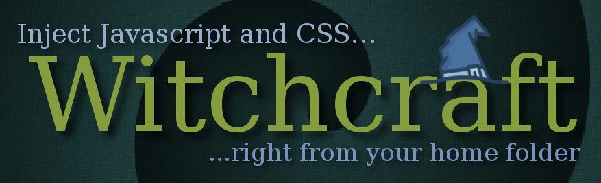
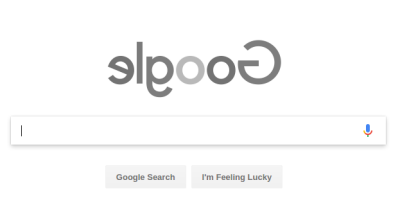

It's GreaseMonkey for developers!

Witchcraft is a Google Chrome extension that executes JavaScript and CSS scripts located under your local `~/.witchcraft` folder by matching their names with the domain of the page being loaded.

If you navigate to `https://www.google.com`, Witchcraft will execute `~/.witchcraft/google.com.js` and `~/.witchcraft/google.com.css`.

This makes it super easy to spruce up your favorite pages using JavaScript and your own stylesheets.

On subdomains such as `gist.github.com`, Witchcraft will try to load `~/.witchcraft/gist.github.com.js`, as well as `~/.witchcraft/github.com.js` and `~/.witchcraft/com.js`. The same goes with CSS: `~/.witchcraft/gist.github.com.css`, `~/.witchcraft/github.com.css` and `~/.witchcraft/com.css` will be tried.

GreaseMonkey user scripts are great, but you need to publish them somewhere and re-publish after making modifications. With Witchcraft, just add or edit files in `~/.witchcraft`. Script changes will immediately be seen by the extension; no need to reload anything.

## What if I want to inject jQuery (or any other library?)

Use `@include` directives. Inside your main script (say, `google.com.js`), write:

    // @include jquery.js

And then just add `jquery.js` to your `~/.witchcraft` folder. You can any number of scripts you want. Included scripts will also have their `@include` directives parsed in a recursive fashion. Dependency cycles (e.g., `foo` includes `bar`, which includes `foo` won't break the parser and the resulting script will be `<contents of bar>\n<contents of foo>`.

# Example

    > cat ~/.witchcraft/google.com.js

    document.querySelectorAll('img')
        .forEach(img => img.style.transform = 'scaleX(-1)');

Or you could also just:

    > cat ~/.witchcraft/google.com.css

    img {
        transform: scaleX(-1);
    }

# How to install

This extension is composed of two parts: the Chrome extension itself and a local HTTP server running on Node.js. Follow these two steps below to install it.

## Step 1: start the server

First make sure you have [Node.js](https://nodejs.org) installed.

Go to the root of this repository and simply run:

    node witchcraft

*Note: you may want to add it to your shell's login script, otherwise you'll need to restart it every time you reboot your system. A sample script you could try:*

    #!/usr/bin/env bash
    nohup node /path/to/witchcraft/witchcraft.js &

## Step 2: install Chrome extension

Either [download the official release from the Chrome Web Store](https://chrome.google.com/webstore/detail/witchcraft-inject-js-and/hokcepcfcicnhalinladgknhaljndhpc) or install it as a development extension (look for it under the folder `chrome-extension/`).

After both the server is running and the extension is installed, you're good to go. Write your kick-ass scripts and just put them under `~/.witchcraft`.

# How it works

Chrome extensions* can't access the local file system, so Witchcraft runs a tiny web server on port 3131 that serves files out of `~/.witchcraft`.

The Witchcraft Chrome extension then makes ajax requests to

* http://localhost:3131/css/www.google.com
* http://localhost:3131/js/www.google.com

any time you hit a page on `www.google.com`, for example, and executes the returned JavaScript. As for CSS, it will append any relevant CSS files to the page's head tag.

Our tiny server, upon receiving a request to `www.google.com`, looks for these scripts, in this exact order:

* `~/.witchcraft/com.css`
* `~/.witchcraft/google.com.css`
* `~/.witchcraft/www.google.com.css`
* `~/.witchcraft/com.js`
* `~/.witchcraft/google.com.js`
* `~/.witchcraft/www.google.com.js`

And it returns a bundled version of all scripts it can find for each type (one bundle for Javascript and another one for CSS), ready to be executed by the extension. So, if there were a `com.js` and a `www.google.com.js`, the resulting script would be a concatenation of them. The same with CSS.

Contextual note: Witchcraft is my rendition of [defunkt](https://github.com/defunkt)'s original tool, [dotjs](https://github.com/defunkt/dotjs). Although I never got to actually use his implementation, I really wanted something like that. My approach works just the same as his, but it's way easier to install and should work for any platform that is able to run Node.js.

Defunkt's original dot.js server also had another drawback: it ran over HTTPS, since Chrome complains if you request something over HTTP on a HTTPS page. This issue is called "mixed content" (see [this explanation](https://developers.google.com/web/fundamentals/security/prevent-mixed-content/what-is-mixed-content)).

Witchcraft, on the other hand, allows us to request HTTP just fine, though. Chrome extensions have a foreground environment, where you have access to a page's content, and a background one, where your scripts run in a exclusive process created just for your extension. This same background process is shared among all your foreground instances. It also happens that the background process can request whatever it wants, including HTTP (non-secure) requests; and this is just what we need. Witchcraft's foreground script fires requests to the background one, which then proceeds to requesting to Witchcraft's local server via HTTP. When the response gets back, the background script calls the foreground with the scripts' contents.

# To do

- implement include directives for CSS
- allow for loading of custom images;
- cache scripts in memory to avoid going to the disk all the time
  (but use Node.js API to watch for files changes, otherwise cache will get outdated)
- user Node.js file watch API to avoid hitting the disk every time some page is loaded, given that most won't have a matching script
  (keep an up-to-date set of all existing script names in memory to quickly answer requests that won't match anything)

# Credits

* [defunkt](https://github.com/defunkt) and his [dotjs](https://github.com/defunkt/dotjs);
* witch and witch hat icons by [Freepik](https://www.flaticon.com/authors/freepik), downloaded from [Flaticon](https://www.flaticon.com).

# Other approaches

[Matthew Hadley](https://github.com/diffsky) made [an experiment](https://github.com/diffsky/chromedotfiles) using the [chrome.tabs API](https://developer.chrome.com/extensions/tabs) to load js and css without the need of a web server. The drawback is that you have to reload the extension every time a new script is added or updated. That's why I decided to have a web server running; I want script loading to be as seamless as possible.

There's also [Jonathan Cremin](https://github.com/kudos)'s [Punkjs](https://github.com/kudos/punkjs), but I tried and it is currently not working (the app breaks when you select the .js folder) and I think that between extension+server and extension+app, I prefer the former. You can just schedule the server to run every time your system boots and then forget about it. The Chrome app approach expects you to open the app every time you open your browser. Besides, it seems to be no longer maintained as well.
